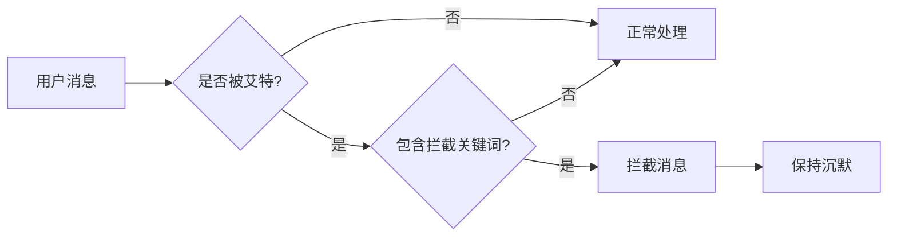

# 🤫 Silent Interceptor

<div align="center">


**一个优雅的 AstrBot 消息拦截插件**

*让机器人在需要的时候保持沉默* 🤐

[安装教程](#-安装指南) · [使用方法](#-使用指南) · [问题反馈](https://github.com/Huanghun542/astrbot_plugin_silent_interceptor/issues)

</div>

---

## 📖 插件简介

Silent Interceptor 是一个轻量级的 AstrBot 插件，专为需要让机器人在特定场景下保持沉默而设计。当机器人被艾特并收到预设的关键词时，插件会智能拦截消息，阻止 LLM 生成任何回复，实现完美的"静音"效果。

## ✨ 功能亮点

<table>
<tr>
<td align="center" width="25%">

### 🎯 智能拦截
在 LLM 响应前精准捕获目标消息<br/>
从根源阻止机器人回应

</td>
<td align="center" width="25%">

### 🔇 静默处理
成功拦截后完全静音<br/>
完美实现"闭嘴"、"安静"效果

</td>
<td align="center" width="25%">

### ⚙️ 网页配置
无需修改代码<br/>
动态添加/删除拦截关键词

</td>
<td align="center" width="25%">

### 🔍 精准触发
仅在私聊或被明确艾特时生效<br/>
避免误伤其他用户对话

</td>
</tr>
</table>

---

## 🚀 快速开始

### 系统要求

| 组件 | 版本要求 |
|------|----------|
| Python | 3.8 或更高版本 |
| AstrBot | v4.0 或更高版本 |
| 依赖 | 无外部依赖 |

### 📦 安装指南

#### 步骤 1: 下载插件
```bash
# 方法一：Git 克隆
git clone https://github.com/Huanghun542/astrbot_plugin_silent_interceptor.git

# 方法二：直接下载 ZIP 文件并解压
```

#### 步骤 2: 部署插件
```bash
# 将插件文件夹移动到 AstrBot 插件目录
mv astrbot_plugin_silent_interceptor /path/to/AstrBot/data/plugins/
```

#### 步骤 3: 重启服务
- 重启您的 AstrBot 程序
- 或在后台管理界面热重载插件

> 💡 **提示**: 本插件无需安装额外依赖，开箱即用！

---

## 🎮 使用指南

### 配置界面

1. 打开 **AstrBot 后台管理**
2. 导航至 **插件市场** → **已安装** → **astrbot_plugin_silent_interceptor 配置**
3. 在配置界面中设置拦截关键词

<div align="center">

</div>

### 基本用法

| 场景 | 操作方式 | 示例 |
|------|----------|------|
| **群聊** | 艾特机器人 + 关键词 | `@机器人 闭嘴` |
| **私聊** | 直接发送关键词 | `安静` |

### 效果演示

```
用户：@机器人 闭嘴
机器人：[已读不回] 🤐
```

---

## 🔧 高级配置

### 关键词管理

在配置界面的"拦截关键词列表"中，您可以：

- ➕ **添加新关键词**: 点击添加按钮输入新词语
- ✏️ **编辑现有关键词**: 直接点击词语进行修改
- 🗑️ **删除关键词**: 点击删除按钮移除不需要的词语

### 实时生效

- 所有配置修改即时生效
- 无需重启机器人
- 支持动态热更新

---

## 🛡️ 工作原理



---

## 🤝 贡献指南

我们欢迎任何形式的贡献！

### 如何贡献

1. 🍴 Fork 本仓库
2. 🔧 创建功能分支: `git checkout -b feature/your-feature`
3. 💾 提交更改: `git commit -am 'Add some feature'`
4. 📤 推送分支: `git push origin feature/your-feature`
5. 📋 创建 Pull Request

### 问题反馈

遇到问题？请通过以下方式联系我们：

- 🐛 [提交 Issue](https://github.com/Huanghun542/astrbot_plugin_silent_interceptor/issues/new)
- 💬 [讨论区交流](https://github.com/Huanghun542/astrbot_plugin_silent_interceptor/discussions)

---

## 📋 更新日志

### v1.0.0 (2024-XX-XX)
- ✨ 初始版本发布
- 🎯 支持消息拦截功能
- ⚙️ 网页配置界面
- 🔇 静默处理机制

---

## 📄 开源协议

本项目采用 [MIT License](LICENSE) 开源协议。

```
MIT License

Copyright (c) 2024 Huanghun542

Permission is hereby granted, free of charge, to any person obtaining a copy
of this software and associated documentation files (the "Software"), to deal
in the Software without restriction, including without limitation the rights
to use, copy, modify, merge, publish, distribute, sublicense, and/or sell
copies of the Software, and to permit persons to whom the Software is
furnished to do so, subject to the following conditions:

The above copyright notice and this permission notice shall be included in all
copies or substantial portions of the Software.

THE SOFTWARE IS PROVIDED "AS IS", WITHOUT WARRANTY OF ANY KIND, EXPRESS OR
IMPLIED, INCLUDING BUT NOT LIMITED TO THE WARRANTIES OF MERCHANTABILITY,
FITNESS FOR A PARTICULAR PURPOSE AND NONINFRINGEMENT. IN NO EVENT SHALL THE
AUTHORS OR COPYRIGHT HOLDERS BE LIABLE FOR ANY CLAIM, DAMAGES OR OTHER
LIABILITY, WHETHER IN AN ACTION OF CONTRACT, TORT OR OTHERWISE, ARISING FROM,
OUT OF OR IN CONNECTION WITH THE SOFTWARE OR THE USE OR OTHER DEALINGS IN THE
SOFTWARE.
```

---

<div align="center">

**如果这个插件对您有帮助，请考虑给个 ⭐ Star！**

Made with ❤️ by [Huanghun542](https://github.com/Huanghun542)

</div>
